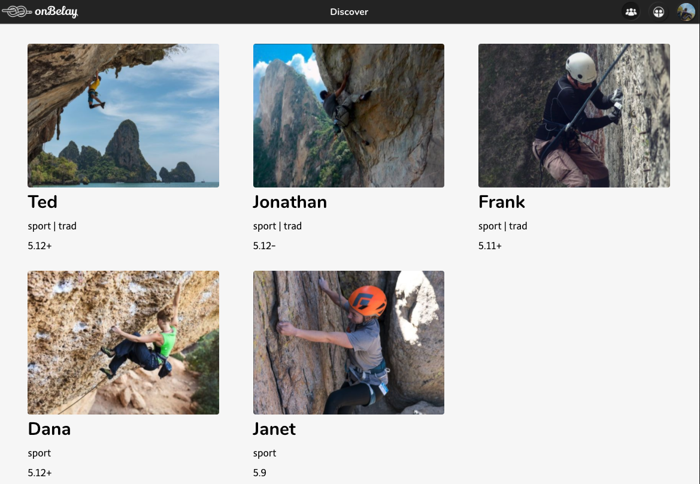
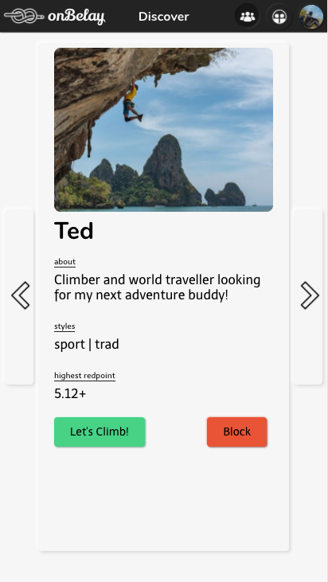

# onBelay
onBelay is a partner finder app for Rock Climbers. It let's climbers connect with other potential climbing partners that climb similar styles and within the same range of grades.

Create a user account and define a location, radius, and some basic information about your climbing experience and what you're looking for in a partner. The app will then show you all of the other climbers in the area. If you're interested in climbing with another user on the app, request them. If you request each other, you'll be connected as partners and the app will share your contact info.

The app is still in early stages of development, many features yet to come.

### Live App
https://onbelayapp.com

### API Repo
https://github.com/keenanmcdonald/onbelay-server

### Screenshots
Desktop:

Mobile: 

### Technology Used
Front End: Javascript, React
Back End: NodeJS, Express, Postgresql, PostGIS

### Demo Login Credentials
email: user@onbelayapp.com
password: Climbing1